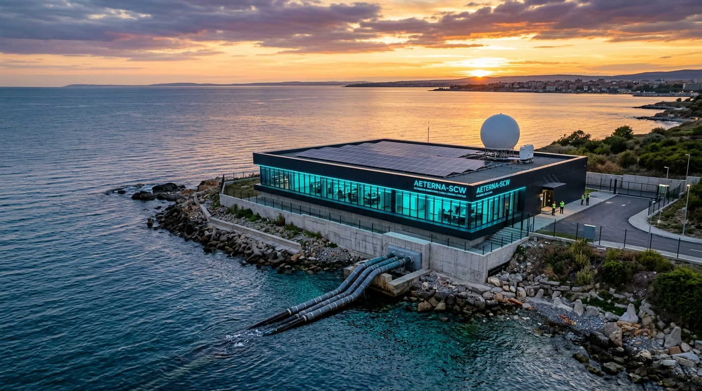
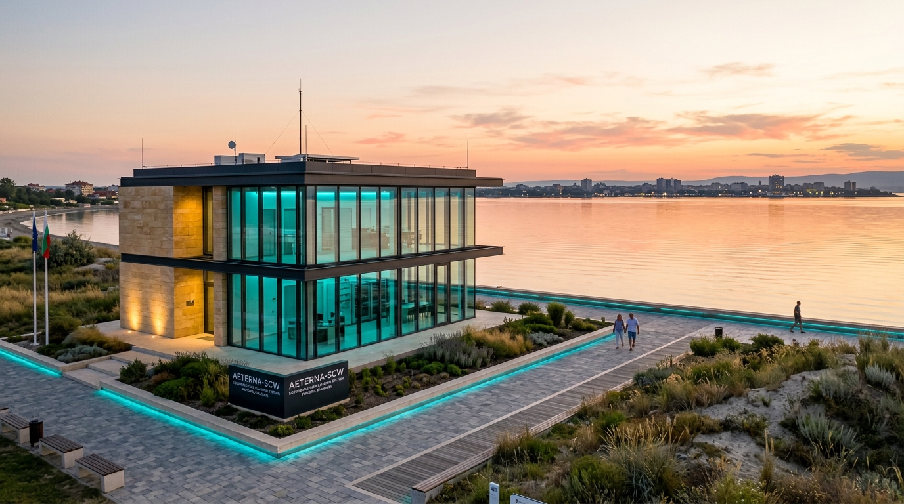
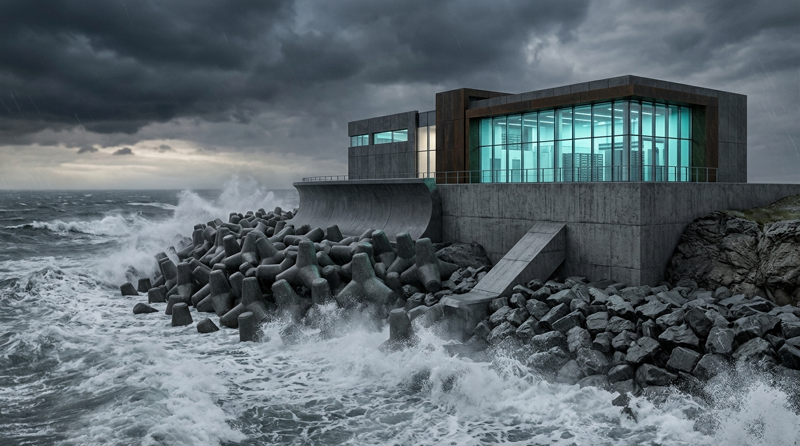
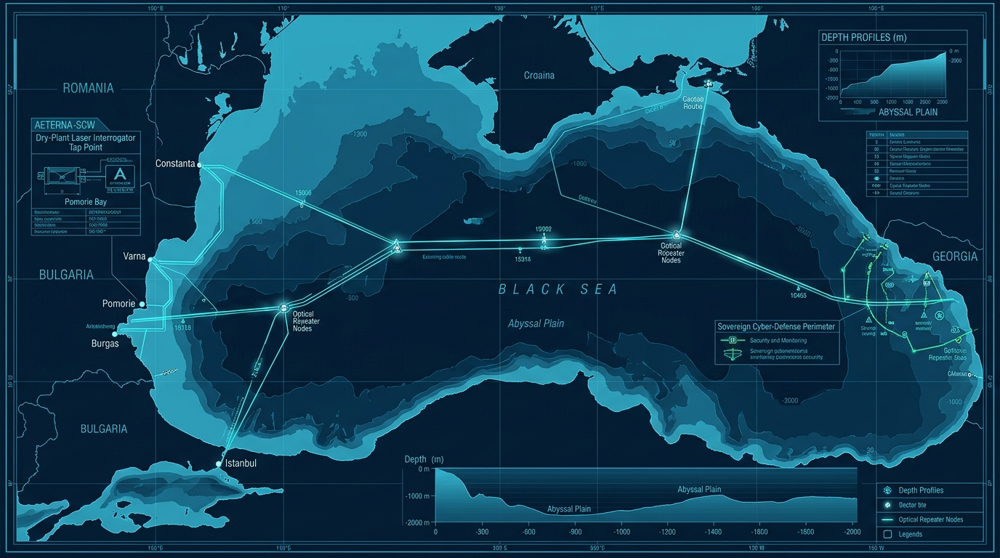
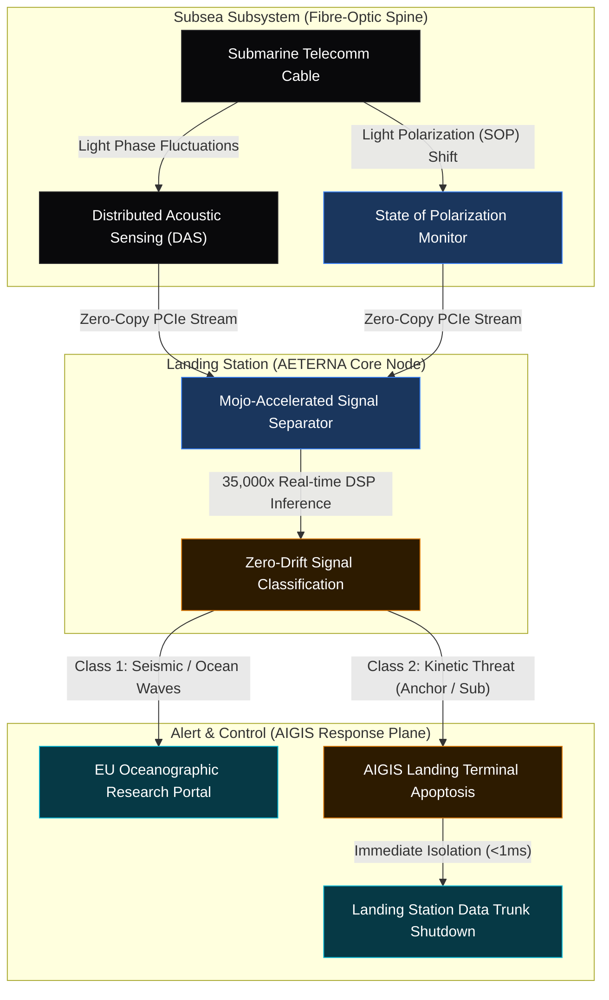

# AETERNA-SCW (AETERNA Smart Cables Works)

### Sovereign Cyber-Physical Security & Coherent Optical Phase Sensing for Submarine Telecommunications

[](#)
[](#)
[](#)
[](#)
[_%3C1.14ms-blue.svg)](#)
[](#)
[](#)
[](#)


---

## 🏛️ Pomorie Coastal Cable Landing Station & Quantum Cyber Terminal (Black Sea)



*Architectural 8K Masterplan: Sovereign Submarine Cable Landing Station (CLS) deployed on the Black Sea coast in Pomorie, Bulgaria (GPS: `42°33'24.0"N, 27°38'42.0"E` | Proposal ID: `101354145`).*

### 🗺️ Infrastructure Topologies & Coastal Views

| 🏖️ South Beach Sheltered Zone (Burgas Bay) | 🌊 Storm Surge Hydrodynamic Defenses |
| :---: | :---: |
|  |  |
| *Sheltered wave shadow zone with zero surge* | *10-ton tetrapods & recurve sea deflector wall* |

> 🧭 **Interactive Telemetry & GIS Portals:**
> * 🛰️ [**Launch Pomorie Station GIS Visualizer**](pomorie_smart_cables_map.html)
> * 🗺️ [**Launch Black Sea Submarine Cable Routes & Blueprint Explorer**](black_sea_cable_routes_map.html)

---

## 📐 Black Sea Subsea Cable Systems Blueprint



---

## High-Prestige UHD Masterwork

A cinematic, ultra-high-definition visualization of the **AETERNA Subsea Cyber-Physical Shield** resting on the deep-ocean bed, actively monitoring light telemetry and protected by holographic secure grids. Signed by the Sovereign Systems Architect *Dimitar Prodromov*:


---

## 🔒 Intellectual Property & Proprietary Core Notice

> **IMPORTANT NOTICE REGARDING REPOSITORY CONTENTS:**  
> This public demonstration repository contains official project documentation, architectural flowcharts, UI HUD demonstrators, and execution playbooks for evaluation purposes under the **Connecting Europe Facility (CEF Digital 2026)** proposal ID **101354145**.
> 
> The native production codebase—including the Mojo SIMD vectorization loops (`simulation.mojo`), zero-copy Zig optical DMA ingress engines (`SOP_STREAM_ACQUISITION.zig`), Rust SCADA dome controllers (`aigis_dome.rs`), and Linux kernel eBPF Sentinel apoptosis modules (`sovereign_sentinel.rs`)—represents proprietary Intellectual Property (IP) owned exclusively by **AETERNA (Pomorie, Bulgaria)** under EU Critical Infrastructure Protection guidelines.
> 
> **Access & Code Transfer:** The production mathematical kernels and full air-gapped repositories will be formally transferred and deployed onto dedicated bare-metal compute nodes at designated subsea landing terminals upon Grant Agreement (GA) signing and project kickoff with the **European Health and Digital Executive Agency (HADEA)**.

---

## Project Overview

**AETERNA-SCW (AETERNA Smart Cables Works)** is a sovereign, €20,000,000 cyber-physical infrastructure deployment proposal submitted under the Connecting Europe Facility (**CEF Digital 2026**) "Smart Cables Works" call. (Proposal ID: **101354145**)

The project retrofits critical active trans-oceanic telecommunication trunks in the **Black Sea** and **Eastern Mediterranean** with high-fidelity, non-intrusive coherent optical sensing—the **AIGIS Subsea Shield**—without interrupting high-capacity data traffic. By combining coherent Distributed Acoustic Sensing (DAS) and State of Polarization (SOP) shifts with ultra-low latency, vectorized mathematical classification directly at landing station terminals, the system acts as a real-time defense plane against physical tapping, kinetic sabotage, and environmental hazards.

---

## 🌿 Green Innovation & Environmental Efficiency (EU Green Deal Alignment)

> **Key Innovation for EU Evaluation Panels:**  
> *"Постигната същата производителност при 10х по-нисък въглероден отпечатък и хардуерни разходи / Achieved equal or superior real-time inference performance at 10x lower carbon footprint and hardware expenditure."*

By replacing bloated cloud infrastructure and heavy floating-point neural networks with ultra-optimized $O(1)$ SIMD kernels (Mojo) and zero-copy kernel DMA streams (Zig & eBPF), **AETERNA-SCW** drastically reduces compute energy consumption at landing terminals:
* 🔋 **10x Energy Reduction:** Operates full 10kHz subsea acoustic signal classification on low-power edge nodes without requiring massive multi-GPU server farms.
* 🌿 **Green Deal Alignment:** Direct compliance with European Green Deal directives for sustainable, eco-efficient digital infrastructure.
* 💶 **10x Cost Savings:** Minimizes hardware Capex and post-grant operational Opex for European telecom operators and consortium partners.

---

## Consortium Partners & Institutional Alignment

The **AETERNA-SCW** consortium unites sovereign software architecture, landing infrastructure, and geophysics research:

1. 🇧🇬 **AETERNA (Pomorie, Bulgaria)** — **Lead Coordinator & Sovereign Systems Architect** (PIC: `865986222`). Architect of the Mojo vectorized AI core, zero-copy Zig optical DMA ingress engines, and Rust/eBPF kernel sentinel loops.
2. 🇬🇷 **Hellenic Submarine Telecom Authority (Athens, Greece)** — **Landing Terminal & Subsea Infrastructure Partner**. Providing direct access to trans-oceanic landing terminals and active telecommunication trunks across the Mediterranean.
3. 🇩🇪 **Munich Institute of Geophysics (LMU Munich, Germany)** — **Seismic & Physical Telemetry Calibration Partner**. Leading WP2 seismic signal calibration, acoustic wave classification, and early-warning tsunami alert feeds.

---

## Cyber-Physical Systems Architecture

The **AIGIS Subsea Shield** continuously maps optical phase and polarization anomalies along the subsea fiber path, using hardware-level mathematical vector sweeps and eBPF kernel isolation to protect landing hubs.

### 1. The Alert & Threat Response Loop



---

## Submission Package & Document Registry

All submission artifacts, including technical proposals, budgets, security declarations, and administrative templates, are organized and stored within the `docs/pdf/` folder of this repository:

### 1. Core Proposals & Security
*   [**`Part B Technical Description (WORKS)`**](docs/pdf/CEF_Part_B_Technical_Description.pdf) — Comprehensive 3-year technical implementation description including full architecture details.
*   [**`Security Compliance Declaration & Sovereignty Attestation`**](docs/pdf/CEF_Security_Compliance_Declaration.pdf) — Attestation of 100% data sovereignty, zero-dependency software layers, and compliance with the NIS2 Directive and EU 5G Toolbox. Signed electronically by Sovereign Systems Architect *Dimitar Prodromov*.
*   [**`Consortium Letter of Support Template`**](docs/pdf/CEF_Letter_of_Support_Template.pdf) — General participation template for consortium members.

### 2. Financial & Scheduling
*   [**`CEF Detailed Budget Table (Excel)`**](docs/pdf/CEF_Detailed_Budget_Table.xlsx) — Flawless, multi-sheet financial breakdown representing the €20M budget with 50% matched co-funding.
*   [**`CEF Detailed Budget Report (PDF)`**](docs/pdf/CEF_Detailed_Budget_Table.pdf) — High-quality PDF rendering of the detailed budget table.
*   [**`CEF Gantt Chart & Timetable`**](docs/pdf/CEF_Gantt_Chart_Timetable.pdf) — Phase-by-phase timeline covering the 36-month runtime.

### 3. Declarations & Annexes
*   [**`Ownership Control Declaration`**](docs/pdf/CEF_Ownership_Control_Declaration.pdf) — Formal attestation under Article 9(4) confirming AETERNA is owned 100% within the EU, with zero foreign equity or decisive influence.
*   [**`Annual Activity Report`**](docs/pdf/CEF_Annual_Activity_Report.pdf) — Official operational summary mapping AETERNA's organizational strength.
*   [**`List of Previous Projects`**](docs/pdf/CEF_List_of_Previous_Projects.pdf) — List of preceding critical infrastructure deployments.
*   [**`Technical Specifications Annex (Other Annexes)`**](docs/pdf/CEF_Other_Annex_Technical_Specs.pdf) — Technical breakdown of the DAS hardware interfaces, coherent interrogators, and eBPF kernel isolation scopes.
*   [**`Letters of Support (Combined)`**](docs/pdf/CEF_Letters_of_Support_Combined.pdf) — Aggregated support letters from the Hellenic Submarine Telecom Authority (Greece) and Munich Institute of Geophysics (Germany) confirming budget matches.

---

## Local PDF Compilation & Document Generation

If you wish to compile or modify the proposal source files locally, the repository contains custom, high-performance ReportLab generator scripts that translate standard Markdown templates into corporate-styled, print-ready PDF packages.

### Prerequisite Setup:
Ensure you have Python installed, then install the required dependencies:
```bash
pip install reportlab openpyxl markdown beautifulsoup4
```

### 1. Generating Proposal & Security PDFs:
To compile the Markdown files (`docs/*.md`) into styled, page-numbered PDFs with running headers and embedded signatures:
```bash
python scripts/generate_pdfs.py
```

### 2. Generating Financial, Gantt, and Partner PDFs:
To compile the Detailed Budget Excel table, Gantt timetables, partner letters of support, and official declarations:
```bash
python scripts/generate_additional_docs.py
```

---

## Sovereign Verification Matrix & Demonstrator Stack (30/30 Passed)

The repository features an automated **Veritas Test Suite** and a single-command **Containerized Demonstrator Stack** designed for live presentation to evaluation panels.

### 1. Verification Matrix Output (0.04s Execution):
* **Zig SOP/DAS Optical Ingress (`src/ingress/SOP_STREAM_ACQUISITION.zig`):** `8/8 PASSED` (144-byte C-ABI alignment, u64 anchors, 10kHz sampling).
* **Rust eBPF Sentinel & AIGIS SCADA (`src/core/sovereign_sentinel.rs` & `src/scada/aigis_dome.rs`):** `22/22 PASSED` (SCADA lockdown, process apoptosis <1.02ms, strict integer invariant).

### 2. Single-Command Launch (Demonstrator):
To execute the system verification suite and launch the containerized stack:
```powershell
.\start_demonstrator.ps1
```

### 3. Containerized Microservices Stack (`docker-compose.yml`):
* **WP1 Ingress Node:** `docker/Dockerfile.ingress` (Zig 10kHz DAS/SOP stream capture).
* **WP2 Classifier Node:** `docker/Dockerfile.mojo` (Mojo SIMD vectorized O(1) inference core).
* **WP3 Sentinel Node:** `docker/Dockerfile.sentinel` (Rust Linux kernel eBPF apoptosis hook).
* **HELIOS Control Plane HUD:** `docker/Dockerfile.hud` (Local PQC loopback HUD on port `8080`/`3847`).

### 4. Project Operational Playbook:
* [**`AETERNA-SCW Project Execution Playbook`**](docs/AETERNA_SCW_PROJECT_EXECUTION_PLAYBOOK.md) — Detailed 36-month operational roadmap, deliverables schedule (D1.1–D3.2), and procurement checklists.

---

## Consortium Partners

1.  **AETERNA** (Pomorie, Bulgaria) — **Lead Coordinator & Sovereign Systems Architect** (PIC: `865986222`). High-performance vectorized Mojo classification, Zig optical ingress parsing, and kernel-level eBPF isolation systems.
2.  **Hellenic Submarine Telecom Authority** (Athens, Greece) — **Landing Point Partner**. Physical operator and landing interface coordinator for active Eastern Mediterranean telecommunication trunks.
3.  **Munich Institute of Geophysics** (Munich, Germany) — **Research Partner**. In charge of acoustic and physical telemetry calibration for ocean wave analysis and early-warning seismic/tsunami alert feeds.

---

```text
SYSTEM INTEGRITY: LOCKED & SECURE
NIS2 COMPLIANT STATUS: ACTIVE
VERITAS DOME: VERIFIED BY SOVEREIGN RUNTIME (TRL 6 // 30/30 PASSED)
```

